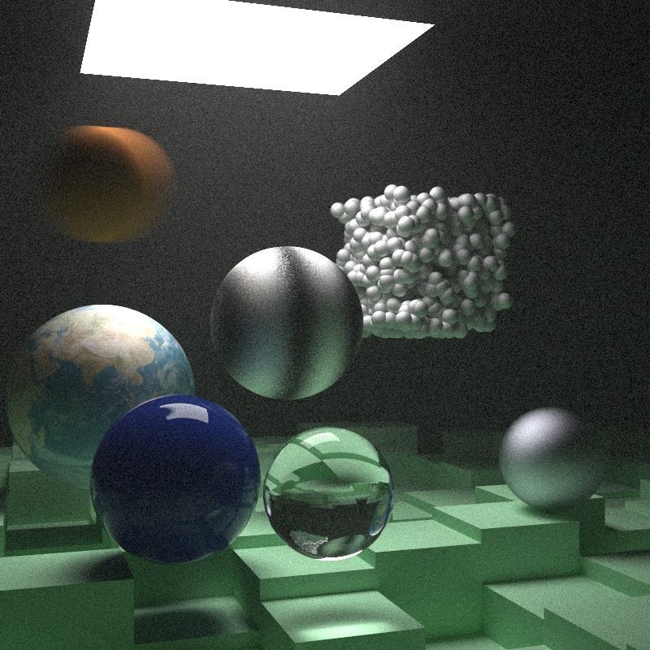

## Ray tracing the next week, in Rust

This is an implementation in Rust of [Peter Shirley's "Ray Tracing The Next Week"](https://github.com/petershirley/raytracingthenextweek) book.

Every tagged commit is the code that generates a specific image. In this way it's easy to follow the progress in the book.

Instead of implementing my own `vec3`, I preferred using `Vector3` from [`nalgebra`](https://crates.io/crates/nalgebra) crate.
For random numbers I used [`rand`](https://crates.io/crates/rand). For image loading I used [`image`](https://crates.io/crates/image)

Hence dependencies are:
- [`nalgebra`](https://www.nalgebra.org)
- [`rand`](https://rust-random.github.io/book/)
- [`image`](https://github.com/image-rs/image)

### Improvements

- I easily made the main loop parallel with the [`rayon`](https://crates.io/crates/rayon) crate.
Just make sure that Traits are marked `Send` and `Sync` and then it's just a matter of using an `into_par_iter()` iterator.
Also, reference counters (`Rc`) must be replaced with their atomic version (`Arc`).
- I improved BVH implementation[1](#footnote1), e.g. split axis are not chosen randomly but based on widest extension of bounding box along that axis.
Objects are sorted along their (doubled) centroid and not their minimum bounding coordinate. Also, I used `Box` instead of `Arc` when building the BVH.

<a name="footnote1">1)</a> _Ideas taken from [@cbiffle](https://github.com/cbiffle)'s ["Rust One-Week-ish Ray Tracer"](https://github.com/cbiffle/rtiow-rust). If you want to see well written idiomatic Rust code have a look at it._

